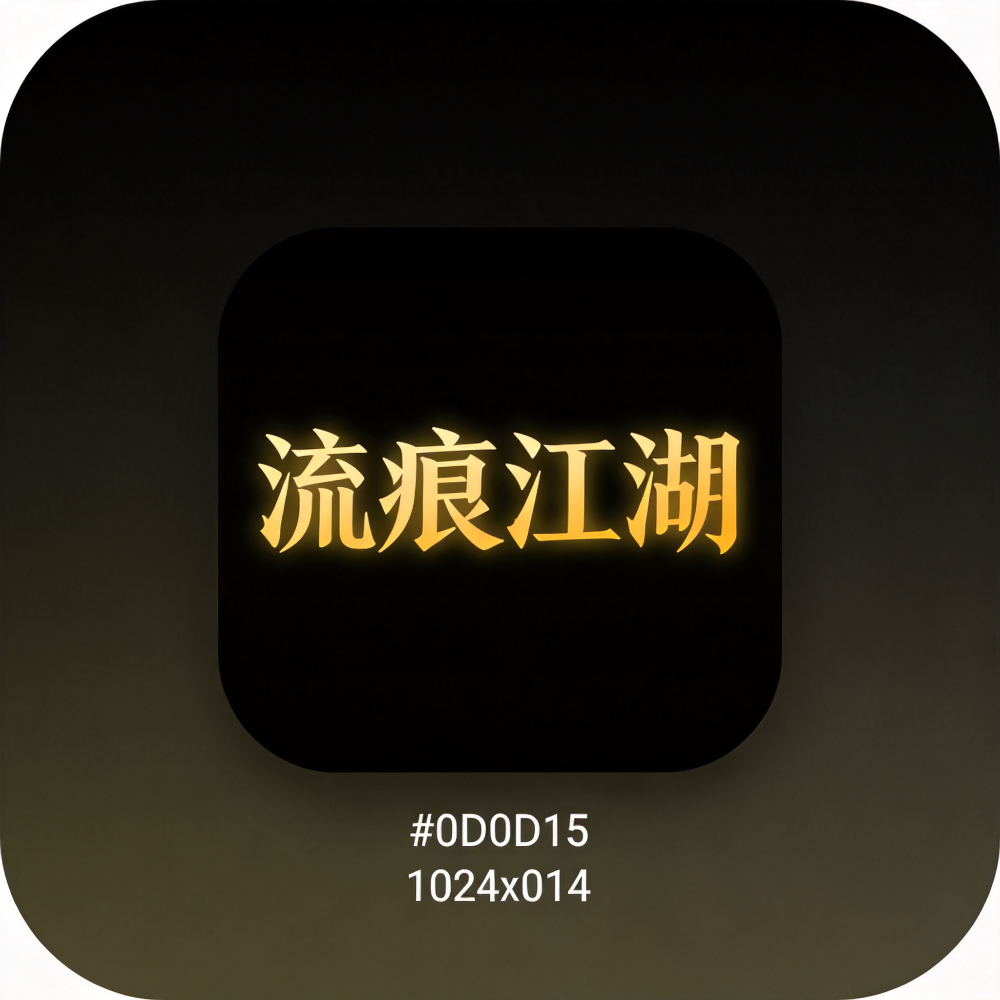

# 流痕江湖 App 图标设计规范

## 图标预览



## 设计参数

### 尺寸规格
| 用途 | 尺寸 | 文件格式 |
|------|------|----------|
| iOS App Store | 1024x1024 px | PNG |
| Android 应用商店 | 512x512 px | PNG |
| 矢量源文件 | 不限 | SVG |

### 配色方案
| 元素 | 颜色值 | 说明 |
|------|--------|------|
| 背景顶部 | `#000000` | 纯黑 |
| 背景底部 | `#FFD700` | 金黄 |
| 水痕主色 | `#FFD700` | 金色 |
| 水痕辅色 | `#FFA500` | 橙金 |
| 渐变方向 | 从上到下 | 垂直渐变 |

### 设计元素
1. **背景**：纯黑到金黄的垂直渐变
2. **主图形**：流动的墨迹/水痕曲线
   - 类似书法笔触的流动曲线
   - 带有发光效果
   - 有墨滴点缀
3. **圆角**：iOS 标准圆角（约 22%）

### 风格特点
- 与登录页面黑黄主题呼应
- 流动感、水墨风格
- 无文字，避免版权问题
- 简洁、辨识度高

## 设计工具建议

### 推荐工具
- **Figma**：免费，支持 SVG 导入导出
- **Adobe Illustrator**：专业矢量设计
- **Sketch**：Mac 专用

### 制作步骤
1. 创建 1024x1024 画布
2. 添加垂直渐变背景（黑→金黄）
3. 使用钢笔工具绘制流动曲线
4. 添加发光效果（高斯模糊）
5. 添加圆角（220px）
6. 导出 PNG

## 文件清单

| 文件 | 说明 |
|------|------|
| `app-icon-1024.png` | 应用商店提交用（1024x1024） |
| `app-icon-final.svg` | 矢量源文件，可编辑 |
| `ICON_DESIGN_SPEC.md` | 本设计规范文档 |

## 在线预览

SVG 文件可直接在浏览器中打开预览：
```
file:///workspace/projects/assets/app-store/icon/app-icon-final.svg
```

## 联系设计师

如需调整设计，请提供：
1. 本规范文档
2. SVG 源文件
3. 参考图片（AI 生成的原始图标）
